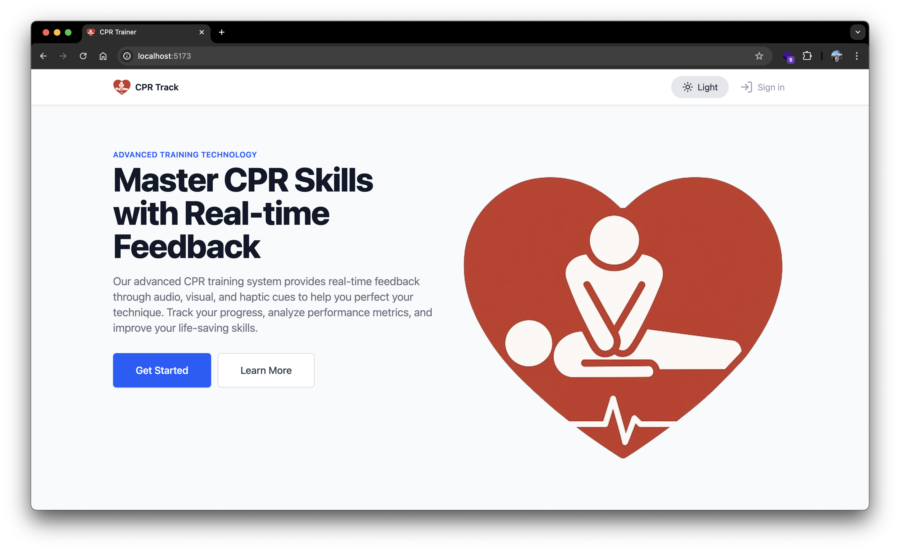
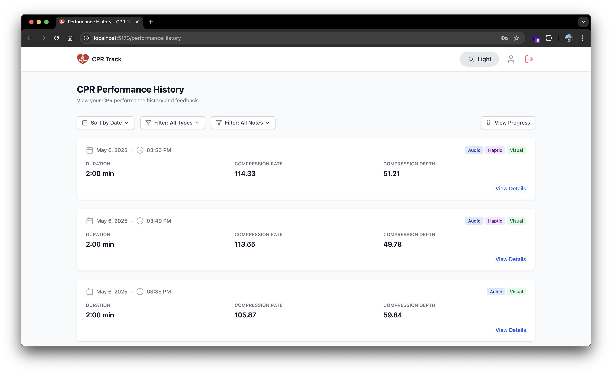
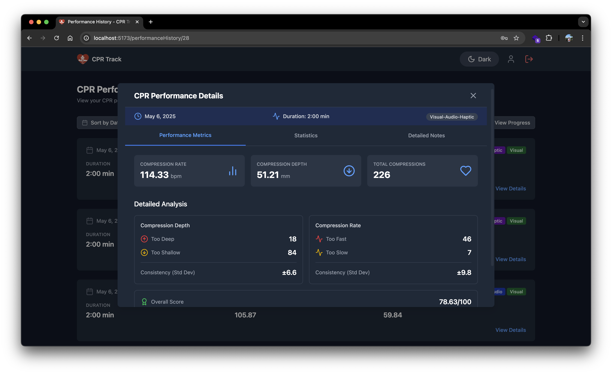
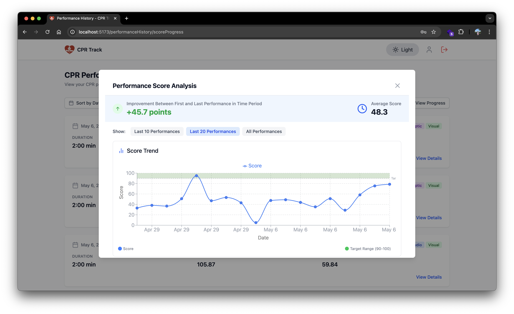
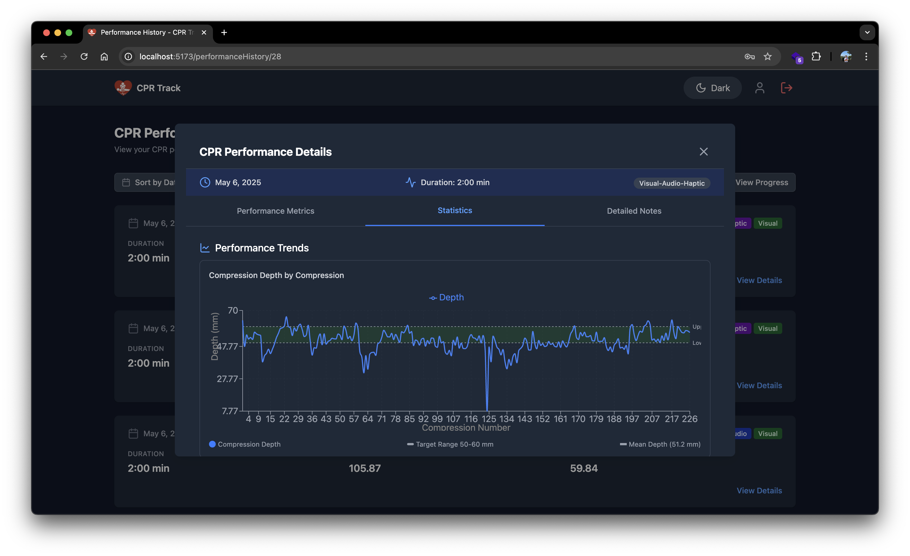
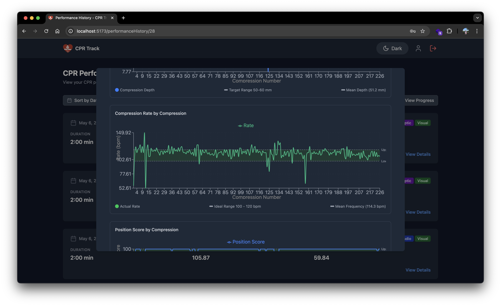
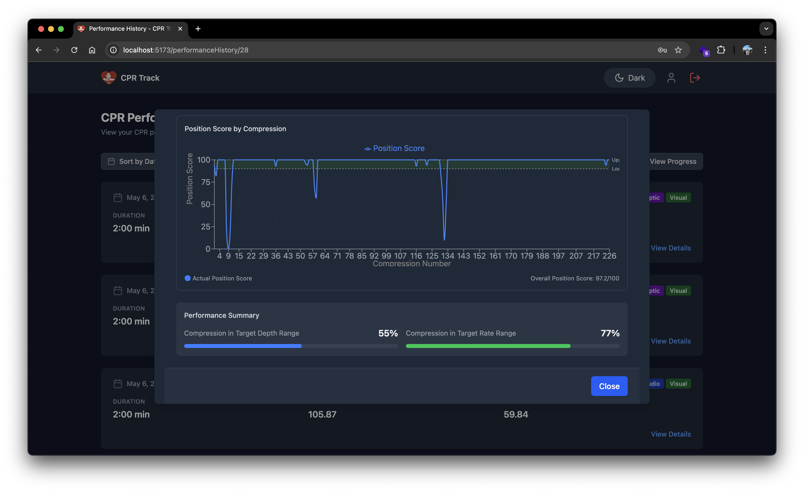
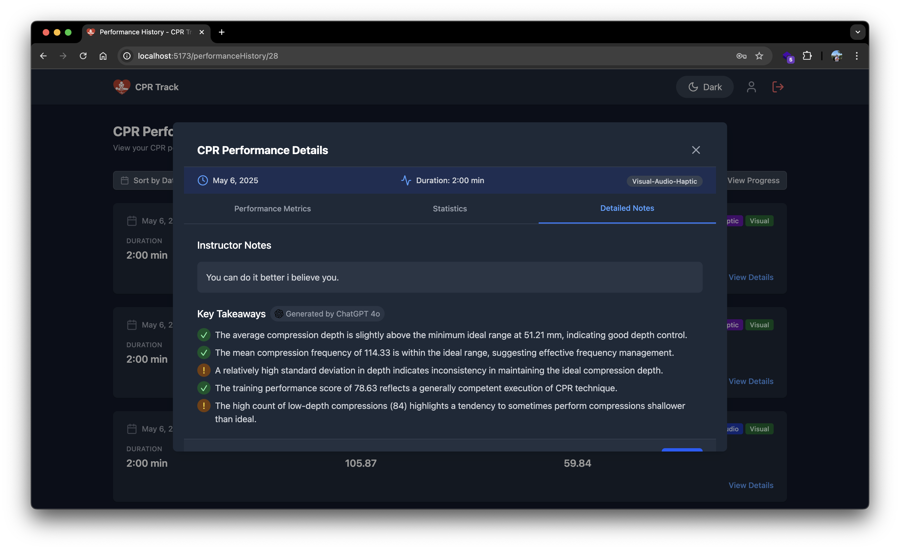

# CPR Trainer Web Application

This is a full-stack web application for CPR training, consisting of a React frontend and Spring Boot backend. This is a requirement for the [CPR Trainer](https://github.com/aliyigittas/CPR-Trainer) project.

## Screenshots

<table>
  <tr>
    <td></td>
    <td></td>
  </tr>
  <tr>
    <td></td>
    <td></td>
  </tr>
  <tr>
    <td></td>
    <td></td>
  </tr>
  <tr>
    <td></td>
    <td></td>
  </tr>
</table>

## Project Structure

```
cpr-trainer-web/
├── cpr-trainer-frontend/    # React + TypeScript frontend
├── cpr-trainer-backend/     # Spring Boot backend
├── db-dumps/               # Database initialization
├── Screenshots/            # Screenshots of the application
└── docker-compose.yml      # Docker configuration
```

## Prerequisites

- Docker and Docker Compose
- Node.js (v20 or higher) for local frontend development
- Java 21 or higher for local backend development
- MySQL 8.3 for local database development

## Environment Setup

### Backend (.env file)

Create a `.env` file in the `cpr-trainer-backend` directory with the following variables:

```env
JWT_SECRET_KEY=<YOUR-JWT-SECRET-KEY>
OPENAI_API_KEY=<YOUR-OPENAI-API-KEY>
```

## Running with Docker

1. Clone the repository:
   ```bash
   git clone https://github.com/aliyigittas/cpr-trainer-web.git
   cd cpr-trainer-web
   ```

2. Start the application using Docker Compose:
   
   for Windows:
   ```bash
   docker-compose up --build
   ```
   for MacOS:
   ```bash
   docker compose up --build
   ```

   This will start:
   - Frontend on http://localhost:5173
   - Backend on http://localhost:8080


## Running Locally

### Database

1. Create a user `cpr-trainer` with password `cprTrainer123` and grant all privileges on the database to the user
2. Import the `cpr.sql` file to the database

### Backend

1. Navigate to the backend directory:
   ```bash
   cd cpr-trainer-backend
   ```

2. Build the project:
   ```bash
   ./mvnw clean install
   ```

3. Run the application:
   ```bash
   ./mvnw spring-boot:run
   ```

### Frontend

1. Navigate to the frontend directory:
   ```bash
   cd cpr-trainer-frontend
   ```

2. Install dependencies:
   ```bash
   npm install
   ```

3. Start the development server:
   ```bash
   npm run dev
   ```

## Development

- Frontend is built with React + TypeScript and uses Vite as the build tool
- Backend is built with Spring Boot
- The application uses Docker for containerization and easy deployment

## Contributing

1. Create a new branch for your feature
2. Make your changes
3. Submit a pull request

## License

This project is licensed under the MIT License - see the [LICENSE](LICENSE) file for details.